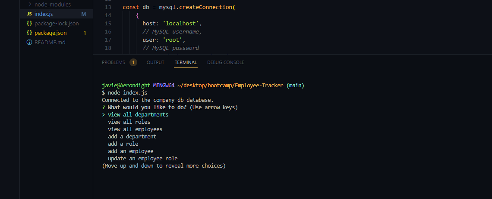

# Employee-Tracker

## Description

This application is a content management system (CMS) that contains data on employees, departments, and roles in the company (mock). This application is meant to run in the terminal and uses inquirer, MySQL, and node.js. I made this application to test my skills with both MySQL and the inquirer package. THe biggest challenge I had with this application was getting the functions that added to the database to work correctly. This application is still in the development phase and needs work on the adding to the database portion still.

## Installation

The steps to install this application are first to make sure you have both mysql2 and inquirer installed/ added to your package.json. After you need to run all the SQL commands in the schema.sql in the MySQL terminal. Then you must run the seed.sql commands in the terminal as well. After you do this the application is ready to use, by typing in the command line node index.js. 

## Usage

When you type in the command line 'node index.js' the user is faced with the prompt of list items pertaining to the database and what the user wants to do. The user can pick any of the options from the list and will be faced with the result of choosing the option. If the user wants to view a department they can select this option and will be presented with the table list of departments. 

  

## Video Link 

https://app.castify.com/view/90261752-3fac-4e11-86f7-6941ece190f0

## License

 Apache License Version 2.0
